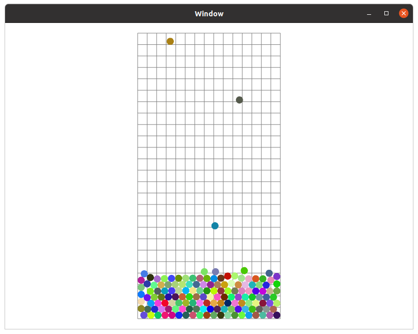

# Packing - DEM
This program simulates packing of spherical particles and creates a creates a 2D visualization with SFML library. Physial interactions between particles are modeled with the Discrete Element Method (DEM). 2D solution was chosen for the ease of visualization, but the program can easily be scaled to three dimensions by adding equations for Z position and velocity and modifying the mat2 class to contain three double precision floating point values.
To reduce complexity of the computation, the world is broken up into chunks. Each chunk is about the size of one particle.
Each chunk contains a linked list with particles that are currently in it. After each time step, the chunks are updated to account for
particles that have moved to different chunks. When calculating forces, it is sufficient to check the adjacent chunks instead of iterating
through all particles.

    

Motion of particles is modeled by solving the following system of differential equations:

    

    

    

